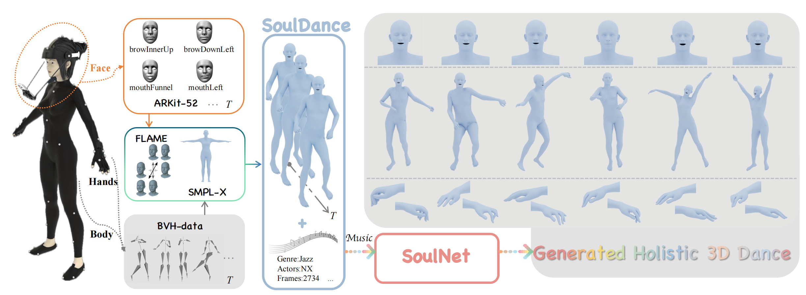

# SoulDance: Music-Aligned Holistic 3D Dance Generation

[](https://arxiv.org/abs/2507.14915)
[](https://arxiv.org/abs/2507.14915)
[](https://xjli360.github.io/SoulDance/)
[](https://www.youtube.com/watch?v=ND0aJVdBBao)
[](https://github.com/xjli360/SoulDance-Official)



> **Abstract**: Well-coordinated, music-aligned holistic dance enhances emotional expressiveness and audience engagement. However, generating such dances remains challenging due to the scarcity of holistic 3D dance datasets, the difficulty of achieving cross-modal alignment between music and dance, and the complexity of modeling interdependent motion across the body, hands, and face.
> To address these challenges, we introduce **SoulDance**, a high-precision music-dance paired dataset captured via professional motion capture systems, featuring meticulously annotated holistic dance movements. Building on this dataset, we propose **SoulNet**, a framework designed to generate music-aligned, kinematically coordinated holistic dance sequences.

## News
- [2025-09] We are currently dealing with legal issues to open-source the dataset. A demo and the dataset would be released once legal problems are solved, please stay tuned.
- [2025-08] The code has been open-sourced.
- [2025-08] Source code is currently undergoing an internal open-source compliance review at ByteDance and will be open-sourced once the review is complete.  
- [2025-07] The **SoulDance Dataset** is now available for **academic use**.  
- [2025-06] **SoulDance** has been **accepted to ICCV 2025**.


## Key Features

- **Hierarchical Residual Vector Quantization**: Models complex, fine-grained motion dependencies across body, hands, and face
- **Music-Aligned Generative Model**: Composes hierarchical motion units into expressive and coordinated holistic dance
- **Music-Motion Retrieval Module**: Pre-trained cross-modal model ensuring temporal synchronization and semantic coherence

## Requirements

### System Requirements
- **OS**: 64-bit Python 3.10
- **Framework**: PyTorch 2.0.0
- **Memory**: At least 24 GB RAM per GPU
- **GPU**: 1–6 high-end NVIDIA GPUs with at least 24 GB of GPU memory
- **CUDA**: NVIDIA drivers, CUDA 12.4 toolkit

### Dependencies

This repository depends on the following specialized libraries:

- [accelerate](https://huggingface.co/docs/accelerate/v0.16.0/en/index) - Distributed training acceleration
- [librosa](https://github.com/librosa/librosa) - Audio analysis
- [jukebox](https://github.com/openai/jukebox) - Music generation models

### Installation

Install all dependencies using pip:

```bash
pip install -r requirements.txt
```

**Note**: This project uses the [SMPL-X](https://smpl-x.is.tue.mpg.de/) human body model and the [FLAME](https://flame.is.tue.mpg.de/) for human face model.


## Dataset Access

> **This dataset is available only for the academic use.** Out of respect and protection for the original data providers, we have collected all the links to the raw data for users to download from the original data creators. Please show your appreciation and support for the work of the original data creators by liking and bookmarking their content if you use this data. Please adhere to the usage rules corresponding to this original data; any ethical or legal violations will be the responsibility of the user. 

**License Requirements**:
1. Sign the EULA form located at `assets/SoulDance-EULA-20250728.pdf`
2. Send the signed form to: [fangshukai@bytedance.com](mailto:fangshukai@bytedance.com) or [beichuan@bytedance.com](mailto:beichuan@bytedance.com)
3. Upon approval, you will receive the download link

**Dataset Setup**:
- Download the SoulDance dataset and place it in the `SoulDance_data/` folder
- Organize files as:
  - Motion data: `data/souldance/motion/slice*.npz`
  - Music data: `data/souldance/music/slice*.mp4`


### Data Preparation

Our original sequences are long-form (2-8 minutes) at 30 FPS. Following [EDGE](https://github.com/Stanford-TML/EDGE) preprocessing, we segment data into 5-second motion+music clips.

#### Motion Feature Extraction

We use [humantomato representation](https://github.com/IDEA-Research/HumanTOMATO) for body and hand pose representation.

```bash
cd data/motion_representation/src
```

**Step 1: Extract joint positions**
```bash
python raw_pose_processing.py
```

**Step 2: Generate motion representation**
```bash
python motion_representation.py
```

**Step 3: Visualization (Optional)**

For joint visualization (input: `b × frame × 52 × 3`):
```bash
python plot_3d_global.py
```

For 623-dim feature visualization (input: `b × frame × 623`):
```bash
python plot_feature.py
```

#### Motion Representation Format

**623-dimensional format**:
- `root_rot_velocity`: (B, seq_len, 1)
- `root_linear_velocity`: (B, seq_len, 2) 
- `root_y`: (B, seq_len, 1)
- `ric_data`: (B, seq_len, 153) - (joint_num-1) × 3 = 51 × 3
- `rot_data`: (B, seq_len, 306) - (joint_num-1) × 6 = 51 × 6
- `local_velocity`: (B, seq_len, 156) - joint_num × 3 = 52 × 3
- `foot_contact`: (B, seq_len, 4)

**723-dimensional format**: 623-dim + 100-dim facial features using [FLAME](https://flame.is.tue.mpg.de/) representation (following [EMAGE](https://pantomatrix.github.io/EMAGE/) methodology).

#### Music Feature Extraction

Choose from multiple music representation formats:

**Librosa Format** (MFCC, Chroma, Spectrogram):
```bash
python create_dataset.py --extract-baseline
```

**Jukebox Format** ([OpenAI Jukebox](https://github.com/openai/jukebox) encoding):
```bash
python create_dataset.py --extract-jukebox
```

**MMR Format** (Music-Motion Retrieval enhanced features):
```bash
cd MMR
python mmr_music_feat256.py
```

## Training Pipeline

The training consists of three main components:

### 1. HRVQ Model Training

**Vector Quantization (VQ)**:
```bash
python3 train_vq.py --vq_type rvq --name vq0 --vq_name vq0_souldance --gpu_id 0 --dataset_name souldance --batch_size 256 --num_quantizers 1 --max_epoch 30 --quantize_dropout_prob 0.2 --gamma 0.05
```

**Residual Vector Quantization (RVQ-5)**:
```bash
python3 train_vq.py --vq_type rvq --name vq5 --vq_name rvq5_souldance --gpu_id 0 --dataset_name souldance --batch_size 256 --num_quantizers 6 --max_epoch 30 --quantize_dropout_prob 0.2 --gamma 0.05
```

**Hierarchical Residual Vector Quantization (HRVQ-5)**:
```bash
python3 train_vq.py --vq_type hrvq --name hvq5 --vq_name hrvq5_souldance --gpu_id 0 --dataset_name souldance --batch_size 256 --num_quantizers 6 --max_epoch 30 --quantize_dropout_prob 0.2 --gamma 0.05
```

### 2. MMR Model Training

```bash
cd MMR
python train_mmr.py model=mmr data=souldance run_dir=outputs/mmr_res
```

### 3. MAGE Model Training

> **Prerequisites**: VQ/RVQ/HRVQ models must be trained before training transformers.

**Masked Transformer**:
```bash
python3 train_m2m.py --name mtrans_hrvq5 --gpu_id 0 --dataset_name souldance --vq_name hrvq5_souldance --latent_dim 256 --music_dir '/MMR/datasets/mmr_music_feats'
```

**Residual Transformer**:
```bash
python3 train_res.py --name res_hrvq5 --gpu_id 0 --dataset_name souldance --vq_name hrvq5_souldance --cond_drop_prob 0.1 --lr 2e-4 --gamma 0.1 --latent_dim 256 --n_heads 6 --mmr_loss --hrvq
```
`--dataset_name`: Motion dataset (aistpp/findance/souldance)

`--batch_size`: Training batch size

`--num_quantizers`: Quantization layers

`--quantize_drop_prob`: Quantization dropout ratio

`--cond_drop_prob`: Condition drop ratio (classifier-free guidance)

`--mmr_loss`: Enable MMR loss supervision

## Evaluation

### VQ/RVQ/HRVQ Reconstruction Evaluation

```bash
python eval_vq.py --gpu_id 0 --name rvq_nq6_dc512_nc512_noshare_qdp0.2 --dataset_name souldance --ext rvq5_souldance
```

### Dance Generation

```bash
python gen_m2m.py --gpu_id 0 --ext eval_souldance --name aist_mtrans_rvq5 --vq_name rvq5_souldance --res_name aist_rtrans_rvq5 --dataset_name souldance --music_dir '/datasets/mmr_souldance_music_feats'
```


## Citation

If you find this work useful for your research, please cite our paper:

```bibtex
@misc{li2025souldance,
    title={Music-Aligned Holistic 3D Dance Generation via Hierarchical Motion Modeling}, 
    author={Xiaojie Li and Ronghui Li and Shukai Fang and Shuzhao Xie and Xiaoyang Guo and Jiaqing Zhou and Junkun Peng and Zhi Wang},
    year={2025},
    eprint={2507.14915},
    archivePrefix={arXiv},
    primaryClass={cs.MM},
    url={https://arxiv.org/abs/2507.14915}
}
```

## License
This code is distributed under a license for **non-commercial scientific research purposes only**. Any commercial use, reproduction, or distribution is prohibited without explicit permission from the authors.  

Note that our code depends on other libraries, including SMPL, SMPL-X, PyTorch3D, and uses datasets which each have their own respective licenses that must also be followed.

## Acknowledgements

We thank the open-source community for their foundational contributions. Our work builds upon [EDGE](https://github.com/Stanford-TML/EDGE), and [HumanML3D](https://github.com/EricGuo5513/HumanML3D) for data processing; [MoMask](https://github.com/EricGuo5513/momask-codes), [TMR](https://github.com/Mathux/TMR) for generative frameworks. Please cite these works if you use this codebase.

---

<div align="center">
  <b>🕺 Generate expressive holistic dances with SoulDance! 💃</b>
</div>
